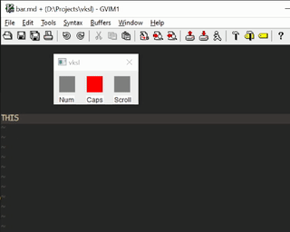

# VKSL(Virtual keyboard status lights)

A Mircosoft windows application that provides virtual keyboard status lights.
Belive it or not some keyboards don't have status lights. Like mine :(.

[my dusty keyboard, don't judge](/screenshots/my_keboard.jpg)

This application implements a mechanism of knowing the state of the caps, scroll and num lock keys.

## Build 

Run the `build.bat` file located in the root directory, You will need to have microsoft's `cl.exe`

## Progress features

Here are some of the things I'm yet to implement

- Configuration management
- UI improvement

If you have ideas of features, open an issue we see what we can do about that. 

## Authors

- [@jnjenga](https://www.github.com/jnjenga)

  
## License

[MIT](https://choosealicense.com/licenses/mit/)

